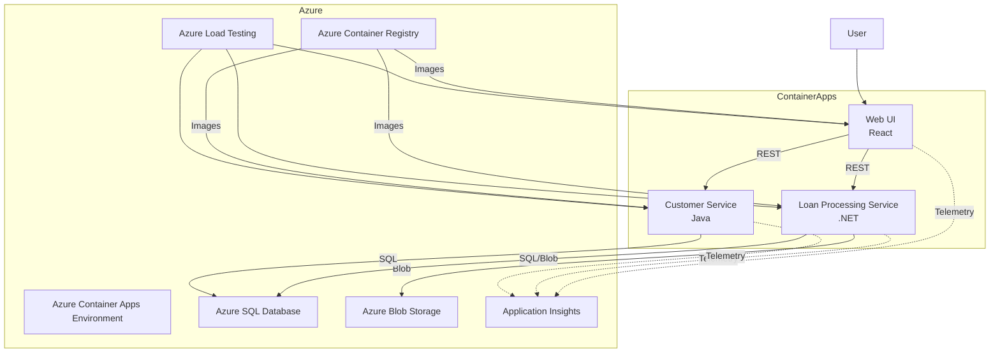
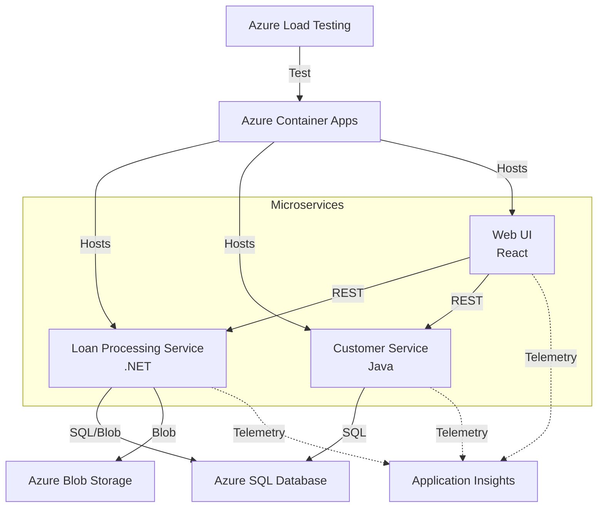

# Mortgage Demo Solution for Azure Application Insights

## Purpose

This solution demonstrates a modern, cloud-native, microservices-based solution, designed to showcase Azure Application Insights, Azure Container Apps, Azure SQL Database, Azure Blob Storage, and Azure Load Testing. It is intended for learning, demonstration, and as a reference for best practices in observability, containerization, and secure cloud development.

Key features:

- Web UI for mortgage application submission and status tracking
- .NET (ASP.NET Core) Loan Processing Service
- Java (Spring Boot) Customer Service
- Azure SQL Database for persistent data
- Azure Blob Storage for document uploads
- All services containerized and deployed to Azure Container Apps
- Managed identities for secure resource access
- Application Insights for end-to-end observability
- Automated load testing and release annotations
- Infrastructure as Code (Bicep) and CI/CD (GitHub Actions)

## Recent Changes

- 2025-07-01: Moved blob container creation from GitHub Actions workflow to Bicep template to avoid issues with network rules and Azure Policies
- 2025-07-02: Fixed health check configuration for Loan Processing Service in Bicep template to use port 8080 and the correct "/health" endpoint for both liveness and readiness probes
- 2025-07-03: Enhanced security by using system-assigned managed identities for Container Registry authentication instead of username/password credentials

---

## Solution Architecture



---

## Deployment and Getting Started

### Prerequisites

- Azure subscription with sufficient quota for Container Apps, SQL, Storage, and Load Testing
- [Azure CLI](https://docs.microsoft.com/en-us/cli/azure/install-azure-cli) installed and logged in
- [Docker](https://www.docker.com/products/docker-desktop) installed
- [GitHub account](https://github.com/) and permissions to create secrets in your fork
- [Java 17+](https://adoptium.net/) and [.NET 8 SDK](https://dotnet.microsoft.com/en-us/download/dotnet/8.0) for local builds (optional)

### 1. Fork and Clone the Repository

```sh
git clone https://github.com/<your-username>/app-insights-demo.git
cd app-insights-demo
```

### 2. Set Up GitHub Secrets

Below are instructions for generating each required secret using the Azure CLI in the Azure Portal's Cloud Shell. After generating each value, copy it and add it as a secret in your GitHub repository (Settings > Secrets and variables > Actions > New repository secret).

> **Note:** The `--sdk-auth` flag for `az ad sp create-for-rbac` is deprecated, but is still required for GitHub Actions. Monitor the [Azure/login GitHub repo](https://github.com/Azure/login) for updates on a new recommended approach.

#### AZURE_CREDENTIALS

Create a service principal with contributor access to your resource group:

```sh
az ad sp create-for-rbac --name "app-insights-demo-sp" --role contributor --scopes /subscriptions/<SUBSCRIPTION_ID>/resourceGroups/<RESOURCE_GROUP> --sdk-auth
```

- Replace `<SUBSCRIPTION_ID>` and `<RESOURCE_GROUP>` with your values.
- Copy the full JSON output and use it as the value for `AZURE_CREDENTIALS`.

#### AZURE_CONTAINER_REGISTRY, AZURE_CONTAINER_REGISTRY_USERNAME, AZURE_CONTAINER_REGISTRY_PASSWORD

If you already have an Azure Container Registry (ACR), get its details. Otherwise, create one:

```sh
# Create ACR (if needed)
az acr create --resource-group <RESOURCE_GROUP> --name <ACR_NAME> --sku Basic

# Get ACR login server
az acr show --name <ACR_NAME> --query "loginServer" --output tsv

# Get ACR username and password
az acr credential show --name <ACR_NAME>
```

- Use the `loginServer` as `AZURE_CONTAINER_REGISTRY` (e.g., myregistry.azurecr.io).
- Use the `username` and `passwords[0].value` as `AZURE_CONTAINER_REGISTRY_USERNAME` and `AZURE_CONTAINER_REGISTRY_PASSWORD`.

#### AZURE_RESOURCE_GROUP

Set this as a repository variable (not a secret) in GitHub. It is the name of your resource group (string).

#### AZURE_LOCATION

Set this as a repository variable (not a secret) in GitHub. It is the Azure region you want to deploy to (e.g., `eastus`).

#### AZURE_SQL_ADMIN_USERNAME / AZURE_SQL_ADMIN_PASSWORD

Choose a username and password for your Azure SQL admin. Set the password you used when creating the SQL server as `AZURE_SQL_ADMIN_PASSWORD`.

#### Required Role Assignment for GitHub Workflow

> **Important:** The service principal used for `AZURE_CREDENTIALS` must have **User Access Administrator** rights (or Owner) over the target resource group. This is required for the workflow to assign roles to managed identities and other resources.
>
> You can grant this with the following Azure CLI command:
>
> ```sh
> az role assignment create \
>   --assignee <APP_INSIGHTS_DEMO_SP_OBJECT_ID> \
>   --role "User Access Administrator" \
>   --scope /subscriptions/<SUBSCRIPTION_ID>/resourceGroups/<RESOURCE_GROUP>
> ```
>
> - Replace `<APP_INSIGHTS_DEMO_SP_OBJECT_ID>` with the Object ID of your service principal (not the App ID).
> - Replace `<SUBSCRIPTION_ID>` and `<RESOURCE_GROUP>` with your values.
> - You can find the Object ID with:
>   ```sh
>   az ad sp show --id <APP_ID> --query objectId -o tsv
>   ```

---

## Component Overview



---

## Troubleshooting & Tips

- If a deployment step fails, check the GitHub Actions logs for details.
- Ensure all required secrets and variables are set and correct.
- For local development, you can build and run each service using Docker Compose or individual Docker commands.
- Health endpoints and readiness probes are implemented for all services.
- Managed identities are used for secure access to SQL and Blob Storage—no secrets in code.

### Security Implementation

- **System-Assigned Managed Identities**: Each container app uses a system-assigned managed identity to authenticate with Azure Container Registry, Azure SQL, and Azure Blob Storage.
- **Azure AD-Only Authentication**: SQL Server is configured to use Azure AD authentication only (no SQL authentication) for enhanced security.
- **Role-Based Access Control**: Proper RBAC is implemented for all resources:
  - Container apps are granted AcrPull role to pull images from Azure Container Registry
  - Container apps are granted appropriate roles on SQL Database and Blob Storage
  - GitHub Actions service principal is granted SQL Server Contributor and AcrPull roles at appropriate scopes
- **No Credentials in Container Images**: All authentication is done via managed identities, eliminating the need for storing credentials.

### Health Check Implementation

- **Loan Processing Service**: Uses ASP.NET Core's built-in health checks at the `/health` endpoint on port 8080. The health check is mapped in Program.cs with `app.MapHealthChecks("/health")`.
- **Customer Service**: Uses Spring Boot Actuator for health checks at `/actuator/health/liveness` and `/actuator/health/readiness` on port 8080.
- Each service's Dockerfile includes a `HEALTHCHECK` command to verify container health at runtime.
- Container Apps are configured with both liveness and readiness probes to ensure proper startup and operation.

---

## Contributing

Pull requests and issues are welcome! Please open an issue for bugs, questions, or feature requests.

---

## License

This project is for demonstration and educational purposes.

```text
MIT License
```
